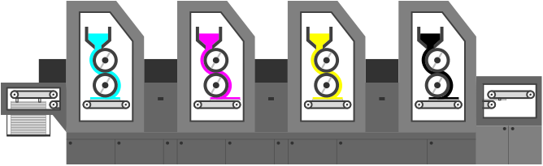

# Offset Printing Machine HMI, with Modbus TCP



This is an HMI QT application. This application is simulating the workings of an offset printing machine in HMI format,
and exposes its data through Modbus registers (specifically, Modbus TCP).

If you're interested in how to use the application, 
refer to the [User guide](user-guide/USERGUIDE.md).

If you need to see the mapping of registers this application provides,
refer to the [Mappings](MAPPINGS.md). 

## Building & Installation

Clone the repository:
```
git clone *link to here* --recurse-submodules
```

### Dependencies

There is a shortcut for this, you can just run my shell script
```
. dependencies.sh
```

Or do this,
dependencies are QT 4, and to install that, you need
```
sudo apt install libqt4-dev libqt4-dev-bin \
                 libpthread-stubs0-dev \
                 libmodbus-dev
```

### Compile & Run

For this, there is also a shortcut. In the root of the git, run
```
. build.sh
(this will move you to /modbus-application-cpp/modbus-application/out/)
```

and then you need to run the app
```
./modbus-application
```

### Modpoll to test registers

After you start the machine, you can use [modpoll](https://www.modbusdriver.com/modpoll.html) to read the registers.
Here is an example of how to get registers, that are 0 if the machine is not running, and 1 is the machine is running. 

```
./modpoll <IP_ADDRESS> -p 2222 -c 1 -t 0 // read coil 0
./modpoll <IP_ADDRESS> -p 2222 -c 1 -t 1 // read discrete input 0
```

### Autostart

Create a xdg autostart entry by copying [modbus-application.desktop](modbus-application.desktop) into */etc/xdg/autostart/*
If you don't want application to start on boot, set
```
X-GNOME-Autostart-enabled=false
```

### How it works

Mostly, there are a few UI elements, that have defined listeners for machine components,
and they receive the data. Next to it, inputs to the machine are also taken through UI 
elements. Libmodbus is handling modbus things, and they run in a second thread,
where messages that are meant to change states of machine are interpreted and handled.
