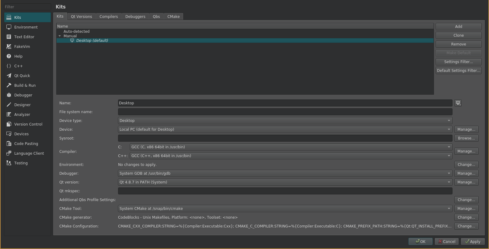

# Offset Printing Machine HMI, with Modbus TCP


This is an HMI QT application. This application is simulating the workings of an offset printing machine in HMI format,
and exposes its data through Modbus registers (specifically, Modbus TCP).

If you're interested in how to use the application, 
refer to the [User guide](user-guide/USERGUIDE.md).

If you need to see the mapping of registers this application provides,
refer to the [Mappings](MAPPINGS.md). 

## Building & Installation

Clone the repository:
```
git clone https://github.com/Wolkabout/offset-printing-machine-simulator-application --recurse-submodules
```

### Dependencies
Run the shell script
```
. dependencies.sh
```

### Compile & Run

For this, there is also a shell script. In the root of the git, run
```
. build.sh
```

go to the `out` folder, and run the app
```
./modbus-application
```

### Modpoll to test registers

After you start the machine, you can use [modpoll](https://www.modbusdriver.com/modpoll.html) to read the registers.
Here is an example of how to get registers, that are 0 if the machine is not running, and 1 is the machine is running. 

(Read the [MAPPINGS.md](MAPPINGS.md) to find out which registers to target)

```
./modpoll <IP_ADDRESS> -p 2222 -c 1 -t 0 // read coil 0
./modpoll <IP_ADDRESS> -p 2222 -c 1 -t 1 // read discrete input 0
```

### Autostart

Create a *xdg autostart* entry by copying [modbus-application.desktop](modbus-application.desktop) into */etc/xdg/autostart/*
If you don't want application to start on boot, set
```
X-GNOME-Autostart-enabled=false
```

## Contribution

#### How it works

Mostly, there are a few UI elements, that have defined listeners for machine components,
and they receive the data. Next to it, inputs to the machine are also taken through UI 
elements. *Libmodbus* is handling modbus connections, and they run in a second thread,
where messages that are meant to change states of machine are interpreted and handled.

#### Setting up QT Creator
This sections is for those who intend to edit the source code.



In [QT Creator](https://www.qt.io/download-qt-installer?hsCtaTracking=99d9dd4f-5681-48d2-b096-470725510d34%7C074ddad0-fdef-4e53-8aa8-5e8a876d6ab4) 
you need to setup the Kit to use the *QT 4.8.7* version for this application.
After you installed the dependencies, go to Tools/Options/Kits, and add a new one. Set the device 
to *Local PC*, device type *Desktop*, Compiler to use *GCC*, *System GDB* for debug, and *QT 4.8.7 in PATH* for Qt version.
When you import the project, choose this as *kit* for the project.
