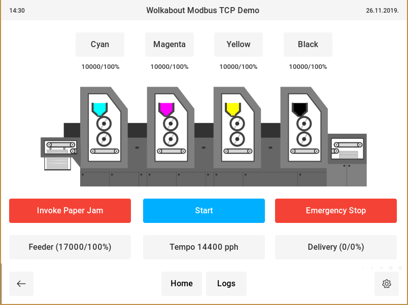
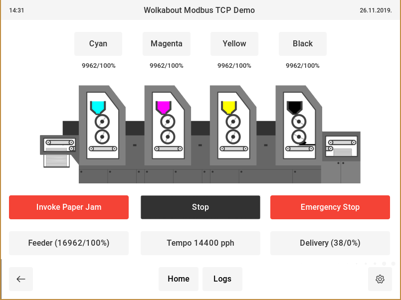
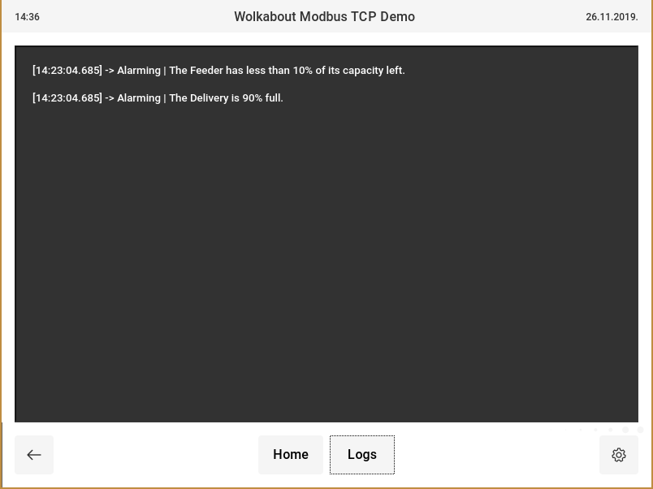
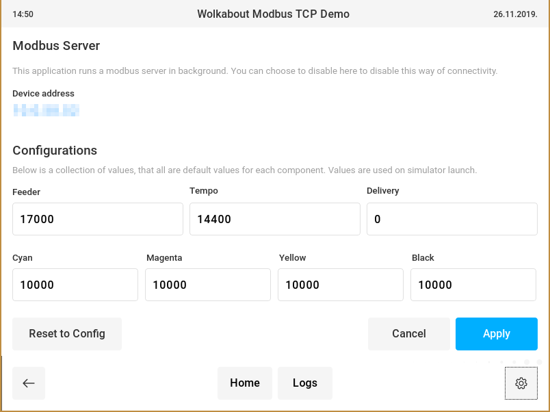

# User guide

This is an overview of the application and its feature-set, and guide to using it all.

### This is the main screen.

It shows controls, where you have the back button, and the home button.
Also, other menus you can go to. Clicking on the "Start Demo" button, leads you to
a screen where the machine is represented, and where you can control it. Logs is a screen
where you can see the log of events/messages that happened, and there is also a settings button.

### Machine screen

Screen while machine is off

Screen while machine is on

You can see if the machine is on/off by the state of the Start/Stop button,
next to it, the animation of the machine printing papers will start when the machine is running,
and all the number will start to change.

Here is where you can find the control of all the components. Click on the name, will pop-up a window,
where you can see the state, and also, change it, and cause the component failure. Changing values will
cause the On-Screen keyboard to pop up on touchscreen devices, which by you can enter a value.

Tempo controls allow you to by steps of 100 reduce the 'prints per hour' number.

### Logs

The logs screen shows the log of all messages provided by the machine. Components that are low/empty will produce
a pop-up window, that will notify you, and also allow you to go directly to the component that is affected. This screen
just shows the timestamp that the alerts were made on.

### Options

Here you can see, the settings screen. It provides an IP-address that the device it is running on is currently using,
and which on it can accept a Modbus connection.
Other than that, you can set the default values as configuration for all the components in the simulator. These values
are used when the simulator is booted up, or when the "Reset to Config" button is pressed. Cancel/Apply do exactly with
values entered, if canceled, all changed are dismissed, accept keeps the changes, and every next reboot, will use those 
values.